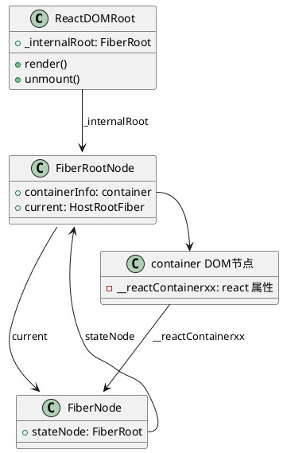
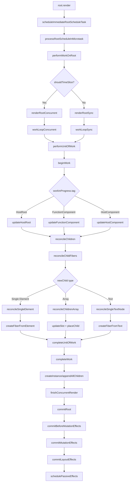
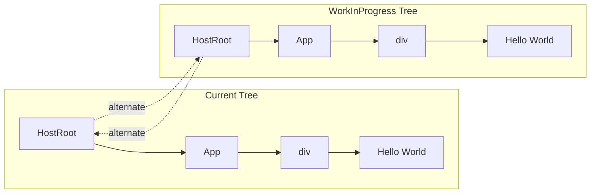

# react 源码分析

## 目标

1. 了解 createRoot 流程 done
2. render 流程 working
   1. workInProgress 是在哪个阶段创建和推送的
3. Fiber 架构的核心对象和功能
4. 了解生命周期钩子是如何触发的？
5. 事件代理原理
6. 更新的流程是怎样的？
7. 如何做差异比对的？

## 核心包

1. **scheduler** 调度器实现在每帧内执行，避免同步渲染的阻塞问题
2. **react-reconciler** 完成 Fiber 树的构建和更新

## 核心对象

### Fiber

1. Fiber 对象，包含如下功能，详细属性如下
   -  引用 Element 树结构
   -  作为渲染的基本单位
   -  作为调度的基本单位
   -  RootFiber 为 UI 树

```js
export type Fiber = {
   tag: WorkTag, // 标识 Fiber 的类型，例如函数组件、类组件、宿主组件等。
   key: null | string, // 唯一标识子节点的键值，用于在调和过程中保持子节点的稳定性。
   elementType: any, // 元素的类型，用于在调和过程中保持组件的身份。
   type: any, // 解析后的函数/类/对象，表示与该 Fiber 关联的组件。
   stateNode: any, // 与该 Fiber 关联的本地状态节点，例如 DOM 节点或类组件实例。
   return: Fiber | null, // 指向父 Fiber 节点。
   child: Fiber | null, // 指向第一个子 Fiber 节点。
   sibling: Fiber | null, // 指向下一个兄弟 Fiber 节点。
   index: number, // 子节点的索引。
   ref:
      | null
      | (((handle: mixed) => void) & { _stringRef: ?string, ... })
      | RefObject, // 引用，用于访问 DOM 节点或组件实例。
   refCleanup: null | (() => void), // 清理引用的函数。
   pendingProps: any, // 当前渲染周期的输入属性。
   memoizedProps: any, // 上一次渲染周期的输入属性。该属性会包含 Element 属性的传入内容，内部的 children 会包含 Element 的子节点信息
   updateQueue: mixed, // 状态更新队列。
   memoizedState: any, // 上一次渲染周期的状态。
   dependencies: Dependencies | null, // 依赖项（上下文、事件等）。
   mode: TypeOfMode, // 描述 Fiber 及其子树的属性的位字段。
   flags: Flags, // 描述 Fiber 及其子树的副作用的位字段。
   subtreeFlags: Flags, // 子树的副作用位字段。
   deletions: Array<Fiber> | null, // 要删除的 Fiber 节点数组。
   lanes: Lanes, // 当前 Fiber 的优先级。
   childLanes: Lanes, // 子树的优先级。
   alternate: Fiber | null, // 备用 Fiber，用于双缓冲机制。
   actualDuration?: number, // 当前更新中渲染该 Fiber 及其子树所花费的时间。
   actualStartTime?: number, // 当前更新中开始渲染该 Fiber 的时间。
   selfBaseDuration?: number, // 最近一次渲染该 Fiber 所花费的时间。
   treeBaseDuration?: number, // 子树的基础时间总和。
   _debugInfo?: ReactDebugInfo | null, // 调试信息。
   _debugOwner?: ReactComponentInfo | Fiber | null, // 调试所有者。
   _debugStack?: string | Error | null, // 调试堆栈。
   _debugTask?: ConsoleTask | null, // 调试任务。
   _debugIsCurrentlyTiming?: boolean, // 是否正在计时。
   _debugNeedsRemount?: boolean, // 是否需要重新挂载。
   _debugHookTypes?: Array<HookType> | null, // 用于验证钩子顺序的类型数组。
};
```

2. Element 对象


3. Update 对象

```js
export type Update<State> = {
  lane: Lane, // 优先级
   // 0 (UpdateState): 普通的状态更新（如调用 setState）。
   // 1 (ReplaceState): 替换当前的状态。
   // 2 (ForceUpdate): 强制组件重新渲染。
   // 3 (CaptureUpdate): 用于错误边界，捕获错误相关的更新。
  tag: 0 | 1 | 2 | 3, // 标识更新的类型
  payload: any, // 存储与更新相关的数据，可能是新状态的对象或一个返回新状态的函数。
  callback: (() => mixed) | null, // 在更新完成后执行的回调函数。
  next: Update<State> | null, // 指向下一个更新，形成链表结构。
};
```

## 代码核心断点

1. 工具函数处理 tag, mode, flags, lanes 等属性对应的含义

```js
const TagMap = {
   0: "FunctionComponent",
   1: "ClassComponent",
   3: "HostRoot", // Root of a host tree. Could be nested inside another node.
   4: "HostPortal", // A subtree. Could be an entry point to a different renderer.
   5: "HostComponent",
   6: "HostText",
   7: "Fragment",
   8: "Mode",
   9: "ContextConsumer",
   10: "ContextProvider",
   11: "ForwardRef",
   12: "Profiler",
   13: "SuspenseComponent",
   14: "MemoComponent",
   15: "SimpleMemoComponent",
   16: "LazyComponent",
   17: "IncompleteClassComponent",
   18: "DehydratedFragment",
   19: "SuspenseListComponent",
   21: "ScopeComponent",
   22: "OffscreenComponent",
   23: "LegacyHiddenComponent",
   24: "CacheComponent",
   25: "TracingMarkerComponent",
   26: "HostHoistable",
   27: "HostSingleton",
   28: "IncompleteFunctionComponent",
   29: "Throw",
};

const ModeMap = {
   0b0000000: "NoMode",
   0b0000001: "ConcurrentMode",
   0b0000010: "ProfileMode",
   0b0000100: "DebugTracingMode",
   0b0001000: "StrictLegacyMode",
   0b0010000: "StrictEffectsMode",
   0b1000000: "NoStrictPassiveEffectsMode",
};
let getModeAsString = (modes) => {
   if (modes === 0) return "NoMode";

   const setModes = [];
   for (const [binStr, modeName] of Object.entries(ModeMap)) {
      const binNum = +binStr;
      if (modes & binNum) {
         setModes.push(modeName);
      }
   }

   return setModes.join(",");
};

const FLAGS = {
   "0b0000000000000000000000000000": "NoFlags",
   "0b0000000000000000000000000001": "PerformedWork",
   "0b0000000000000000000000000010": "Placement",
   "0b0000000000000000000010000000": "DidCapture",
   "0b0000000000000001000000000000": "Hydrating",
   "0b0000000000000000000000000100": "Update",
   "0b0000000000000000000000001000": "Cloned",
   "0b0000000000000000000000010000": "ChildDeletion",
   "0b0000000000000000000000100000": "ContentReset",
   "0b0000000000000000000001000000": "Callback",
   "0b0000000000000000000100000000": "ForceClientRender",
   "0b0000000000000000001000000000": "Ref",
   "0b0000000000000000010000000000": "Snapshot",
   "0b0000000000000000100000000000": "Passive",
   "0b0000000000000010000000000000": "Visibility",
   "0b0000000000000100000000000000": "StoreConsistency",
   "0b0000000000000111111111111111": "HostEffectMask",
   "0b0000000000001000000000000000": "Incomplete",
   "0b0000000000010000000000000000": "ShouldCapture",
   "0b0000000000100000000000000000": "ForceUpdateForLegacySuspense",
   "0b0000000001000000000000000000": "DidPropagateContext",
   "0b0000000010000000000000000000": "NeedsPropagation",
   "0b0000000100000000000000000000": "Forked",
   "0b0000001000000000000000000000": "RefStatic",
   "0b0000010000000000000000000000": "LayoutStatic",
   "0b0000100000000000000000000000": "PassiveStatic",
   "0b0001000000000000000000000000": "MaySuspendCommit",
   "0b0010000000000000000000000000": "PlacementDEV",
   "0b0100000000000000000000000000": "MountLayoutDev",
   "0b1000000000000000000000000000": "MountPassiveDev",
};
let getFlagsAsString = (flags) => {
   if (flags === 0) return "NoFlags";
   const setFlags = [];

   for (const [binStr, flagName] of Object.entries(FLAGS)) {
      const binNum = +binStr;
      if (flags & binNum) {
         setFlags.push(flagName);
      }
   }

   return setFlags.join(",");
};

const LANES = {
   0b0000000000000000000000000000000: "NoLane",
   0b0000000000000000000000000000001: "SyncHydrationLane",
   0b0000000000000000000000000000010: "SyncLane",
   0b0000000000000000000000000000100: "InputContinuousHydrationLane",
   0b0000000000000000000000000001000: "InputContinuousLane",
   0b0000000000000000000000000010000: "DefaultHydrationLane",
   0b0000000000000000000000000100000: "DefaultLane",
   0b0000000000000000000000001000000: "TransitionHydrationLane",
   0b0000000001111111111111110000000: "TransitionLanes",
   0b0000000000000000000000010000000: "TransitionLane1",
   0b0000000000000000000000100000000: "TransitionLane2",
   0b0000000000000000000001000000000: "TransitionLane3",
   0b0000000000000000000010000000000: "TransitionLane4",
   0b0000000000000000000100000000000: "TransitionLane5",
   0b0000000000000000001000000000000: "TransitionLane6",
   0b0000000000000000010000000000000: "TransitionLane7",
   0b0000000000000000100000000000000: "TransitionLane8",
   0b0000000000000001000000000000000: "TransitionLane9",
   0b0000000000000010000000000000000: "TransitionLane10",
   0b0000000000000100000000000000000: "TransitionLane11",
   0b0000000000001000000000000000000: "TransitionLane12",
   0b0000000000010000000000000000000: "TransitionLane13",
   0b0000000000100000000000000000000: "TransitionLane14",
   0b0000000001000000000000000000000: "TransitionLane15",
   0b0000011110000000000000000000000: "RetryLanes",
   0b0000000010000000000000000000000: "RetryLane1",
   0b0000000100000000000000000000000: "RetryLane2",
   0b0000001000000000000000000000000: "RetryLane3",
   0b0000010000000000000000000000000: "RetryLane4",
   0b0000100000000000000000000000000: "SelectiveHydrationLane",
   0b0000111111111111111111111111111: "NonIdleLanes",
   0b0001000000000000000000000000000: "IdleHydrationLane",
   0b0010000000000000000000000000000: "IdleLane",
   0b0100000000000000000000000000000: "OffscreenLane",
   0b1000000000000000000000000000000: "DeferredLane",
};

let getLanesAsString = (lanes) => {
   if (lanes === 0) return "NoLane";
   const setLanes = [];

   for (const [binStr, lanesName] of Object.entries(LANES)) {
      const binNum = +binStr;
      if (lanes & binNum) {
         setLanes.push(lanesName);
      }
   }

   return setLanes.join(",");
};

const propertyMapConvert = {
   mode: (val) => `${val}: ${getModeAsString(val)}`,
   flags: (val) => `${val}: ${getFlagsAsString(val)}`,
   subtreeFlags: (val) => `${val}: ${getFlagsAsString(val)}`,
   lanes: (val) => `${val}: ${getLanesAsString(val)}`,
   childLanes: (val) => `${val}: ${getLanesAsString(val)}`,
   other: (value) => value,
};
let convertPropertyValue = (key, value) => {
   const convert = propertyMapConvert[key] || propertyMapConvert.other;
   return convert(value);
};
```

2. **ReactElement** 末尾追加 `console.log("ReactElement %O", type);` 查看 ReactElement 的内容
3. **FiberNode** 追踪 FiberNode 创建和属性变更的过程, 返回节点是添加如下代码

```js
// 追加 id 标识 fiber
let id = 1;
function FiberNode(tag, pendingProps, key, mode) {
   this._id = id++;
   this.tag = tag;
   this.key = key;
   this.sibling =
      this.child =
      this.return =
      this.stateNode =
      this.type =
      this.elementType =
         null;
   this.index = 0;
   this.refCleanup = this.ref = null;
   this.pendingProps = pendingProps;
   this.dependencies =
      this.memoizedState =
      this.updateQueue =
      this.memoizedProps =
         null;
   this.mode = mode;
   this.subtreeFlags = this.flags = 0;
   this.deletions = null;
   this.childLanes = this.lanes = 0;
   this.alternate = null;
   this.actualDuration = -0;
   this.actualStartTime = -1.1;
   this.treeBaseDuration = this.selfBaseDuration = -0;
   this._debugOwner = this._debugInfo = null;
   this._debugNeedsRemount = !1;
   this._debugHookTypes = null;
   this._mode = getModeAsString(mode); // 调试使用
   hasBadMapPolyfill ||
      "function" !== typeof Object.preventExtensions ||
      Object.preventExtensions(this);
   console.log(`FiberNode${this._id} create ${TagMap[this.tag]}`, this);
   debugger;
   // 使用 Proxy 监听所有 set 操作
   return new Proxy(this, {
      set(target, property, value) {
         // if (property.includes('lags') && getFlagsAsString(value).includes('Update')) {
         //   debugger
         // }
         console.log(
            `FiberNode${target._id} update ${
               TagMap[target.tag]
            } property: %s, value: %O`,
            property,
            convertPropertyValue(property, value)
         );
         target[property] = value;
         return true;
      },
   });
}
```

4. **workInProgress** 重写局部变量，追踪 workInProgress 的推入过程

```js
window._workInProgress = null;
Object.defineProperty(window, "workInProgress", {
   get() {
      return window._workInProgress;
   },

   set(val) {
      console.log(
         `push workInProgress${val?._id} set ${TagMap[val?.tag]} %O`,
         val
      );
      window._workInProgress = val;
   },
});
```

5. **performUnitOfWork** 开始执行任务时，追踪 workInProgress 的推入过程

```js
if (unitOfWork) {
   console.group(
      `performUnitOfWork${unitOfWork?._id} ${TagMap[unitOfWork?.tag]}`
   );
}
```

6. **completeUnitOfWork** 完成任务时，追踪 workInProgress 的推出过程

```js
if (unitOfWork) {
   console.groupEnd(
      `performUnitOfWork${unitOfWork?._id} ${TagMap[unitOfWork?.tag]}`
   );
}
```

7. **beginWork** 开始任务

```js
console.group(`beginWork${workInProgress?._id} ${TagMap[workInProgress?.tag]}`);
```

8. **completeWork** 完成任务， 在 runWithFiberInDEV

```js
function runWithFiberInDEV(fiber, callback, arg0, arg1, arg2, arg3, arg4) {
   var previousFiber = current;
   ReactSharedInternals.getCurrentStack =
      null === fiber ? null : getCurrentFiberStackInDev;
   isRendering = !1;
   current = fiber;
   try {
      return callback(arg0, arg1, arg2, arg3, arg4);
   } finally {
      current = previousFiber;
      if (!arg1?.tag) {
         debugger;
      }
      console.groupEnd(`beginWork${arg1?._id} ${TagMap[arg1?.tag]}`);
   }
   throw Error(
      "runWithFiberInDEV should never be called in production. This is a bug in React."
   );
}
```

9. **commitMutationEffectsOnFiber** 提交任务

```js
// 开始打此点位
console.group(
   `commitMutationEffectsOnFiber${finishedWork?._id} ${
      TagMap[finishedWork?.tag]
   }`
);
// 执行完毕打上
console.groupEnd(
   `commitMutationEffectsOnFiber${finishedWork?._id} ${
      TagMap[finishedWork?.tag]
   }`
);
```

10. 在 container 上打点追踪 dom 更新。
11. Function Component 没有 StateNode 是如何关联的？
12. 拦截 concurrentQueues 的更新

```js
window.concurrentQueues = new Proxy( [], {
   get(target, prop) {
      debugger
      console.log(`Reading concurrentQueues[${prop}]:`, target[prop]);
      return target[prop];
   },
   set(target, prop, value) {
      console.log(`Setting concurrentQueues[${prop}] =`, value);
      debugger
      target[prop] = value;
      return true;
   }
})
```
13. 拦截初始化更新队列
```js
function initializeUpdateQueue(fiber) {
fiber.updateQueue = {
   baseState: fiber.memoizedState,
   firstBaseUpdate: null,
   lastBaseUpdate: null,
   shared: new Proxy(
      { pending: null, lanes: 0, hiddenCallbacks: null },
      {
      set(target, prop, value) {
         if(prop === 'pending') {
            debugger
         }
         target[prop] = value;
         return true;
      }
      }
   ),
   callbacks: null  
};
}
```

## 核心流程分析

### CreateRoot 流程

调用 [ReactDOM.createRoot(container)](https://react.dev/reference/react-dom/client/createRoot) 返回 root 节点 ，核心逻辑包括

1. 事件委托，将事件挂载在 container 节点上 ，详见[listenToAllSupportedEvents](https://github.com/facebook/react/blob/main/packages/react-dom-bindings/src/events/DOMPluginEventSystem.js#L416)
2. 创建 FiberRoot 元素，详见 [ReactFiberRoot](https://github.com/facebook/react/blob/main/packages/react-reconciler/src/ReactFiberRoot.js#L139)
3. 返回 [ReactDOMRoot](https://github.com/facebook/react/blob/main/packages/react-dom/src/client/ReactDOMRoot.js) 对象包含
   * [render(reactNode)](https://react.dev/reference/react-dom/client/createRoot#root-render) 挂载 reactNode 到 container
   * [unmount()](https://react.dev/reference/react-dom/client/createRoot#root-unmount) 卸载 container
   * 对象内部属性 `_internalRoot` 指向 FiberRoot

完成上述过程后会形成如下的对象关系结构





### render 流程

调用 [`root.render(reactNode`)](https://react.dev/reference/react-dom/client/createRoot#root-render) 渲染组件到 container 中，核心逻辑包括

#### 🎯 Render 流程概览图



#### 🔄 双缓冲机制图解



#### 🎯 Render 流程概览图


#### 🔄 双缓冲机制图解


#### 📋 详细执行步骤

1.  执行 [scheduleImmediateRootScheduleTask](../packages/react-reconciler/src/ReactFiberRootScheduler.js#L665) 
   ```js
   // packages/react-reconciler/src/ReactFiberRootScheduler.js:665
   function scheduleImmediateRootScheduleTask(root, priority) {
     if (queueMicrotask !== undefined) {
       // 使用微任务调度，避免阻塞主线程
       queueMicrotask(() => {
         processRootScheduleInMicrotask(root);
       });
     } else {
       // 降级到 setTimeout
       setTimeout(scheduleImmediateRootScheduleTask, 0);
     }
   }
   ```
   **🎯 关键点**: 使用 `queueMicrotask` 确保在下一个微任务中执行，避免阻塞主线程
   
   1. 支持采用 `queueMicrotask` 推入任务
   2. 不支持采用 [unstable_scheduleCallback](../packages/scheduler/src/forks/Scheduler.js#L327) 执行任务采用 setTimeout(scheduleImmediateRootScheduleTask,0) 调度任务

2. 异步触发 [processRootScheduleInMicrotask](../packages/react-reconciler/src/ReactFiberRootScheduler.js#L258)
   ```js
   // packages/react-reconciler/src/ReactFiberRootScheduler.js:258
   function processRootScheduleInMicrotask(root) {
     // 处理根节点的调度任务
     scheduleTaskForRootDuringMicrotask(root);
   }
   ```

3. 触发 [scheduleTaskForRootDuringMicrotask](../packages/react-reconciler/src/ReactFiberRootScheduler.js#L383)

4. 生成回调节点 [newCallbackNode](../packages/react-reconciler/src/ReactFiberRootScheduler.js#L499)

5. 异步执行 [performWorkOnRootViaSchedulerTask](../packages/react-reconciler/src/ReactFiberRootScheduler.js#L512)

6. 触发 [performWorkOnRoot](../packages/react-reconciler/src/ReactFiberRootScheduler.js#L589)

7. 执行 [performWorkOnRoot](../packages/react-reconciler/src/ReactFiberWorkLoop.js#L1015)
   ```js
   // packages/react-reconciler/src/ReactFiberWorkLoop.js:1015
   function performWorkOnRoot(root, lanes, forceSync) {
     // 根据是否需要时间切片选择渲染模式
     const shouldTimeSlice = !forceSync && 
       !includesBlockingLane(lanes) && 
       !includesExpiredLane(root, lanes);

     let exitStatus = shouldTimeSlice
       ? renderRootConcurrent(root, lanes)  // 并发渲染
       : renderRootSync(root, lanes, true); // 同步渲染

     return exitStatus;
   }
   ```
   **🎯 关键点**: `shouldTimeSlice` 决定使用并发渲染还是同步渲染
   
   1. 基于 shouldTimeSlice 判断触发 [renderRootConcurrent](../packages/react-reconciler/src/ReactFiberWorkLoop.js#L2474) 还是 [renderRootSync](../packages/react-reconciler/src/ReactFiberWorkLoop.js#L2318)
   2. 触发 [renderRootSync](../packages/react-reconciler/src/ReactFiberWorkLoop.js#L2318)
      1. [prepareFreshStack](../packages/react-reconciler/src/ReactFiberWorkLoop.js#L1835) 准备需要处理的帧
         ```js
         // packages/react-reconciler/src/ReactFiberWorkLoop.js:1835
         function prepareFreshStack(root, lanes) {
           // 重置工作进度
           workInProgressRoot = root;
           workInProgressRootRenderLanes = lanes;
           
           // 创建 workInProgress 树
           const rootWorkInProgress = createWorkInProgress(root.current, null);
           workInProgress = rootWorkInProgress;
           
           // 初始化渲染上下文
           workInProgressRootIsPrerendering = checkIfRootIsPrerendering(root, lanes);
         }
         ```
         **🎯 关键点**: 创建 `workInProgress` 树，这是双缓冲机制的核心
         
         1. [createWorkInProgress](../packages/react-reconciler/src/ReactFiber.js#L) 此处完成的 continaer Fiber Node alternate 和 current 的赋值
         2. 这个值会赋值给 [rootWorkInProgress](../packages/react-reconciler/src/ReactFiberWorkLoop.js#L1971) 作为后续第一个执行的 workInProgress
      2. 初始化 container 对应的 FiberNode , [createWorkInprogress](../packages/react-reconciler/src/ReactFiber.js#L327) 该节点挂在 rootFiber.current, current 属性是在 [createFiberRoot](../packages/react-reconciler/src/ReactFiberRoot.js#L212) 的时候初始化成功
   3. 触发 [workLoopSync](../packages/react-reconciler/src/ReactFiberWorkLoop.js#L2467)
      ```js
      function workLoopSync() {
         // Perform work without checking if we need to yield between fiber.
         while (workInProgress !== null) {
            performUnitOfWork(workInProgress);
         }
      }
      ```
      **🎯 关键点**: 这是渲染阶段的核心循环，深度优先遍历 Fiber 树
      
   4. 执行 [performUnitOfWork](../packages/react-reconciler/src/ReactFiberWorkLoop.js#L2776)
      ```js
      // packages/react-reconciler/src/ReactFiberWorkLoop.js:2776
      function performUnitOfWork(unitOfWork) {
        const current = unitOfWork.alternate;
        
        let next;
        if (enableProfilerTimer && (unitOfWork.mode & ProfileMode) !== NoMode) {
          startProfilerTimer(unitOfWork);
          next = beginWork(current, unitOfWork, entangledRenderLanes);
          stopProfilerTimerIfRunningAndRecordDuration(unitOfWork);
        } else {
          next = beginWork(current, unitOfWork, entangledRenderLanes);
        }

        unitOfWork.memoizedProps = unitOfWork.pendingProps;
        
        if (next === null) {
          // 如果没有子节点，完成当前工作单元
          completeUnitOfWork(unitOfWork);
        } else {
          // 继续处理子节点
          workInProgress = next;
        }
      }
      ```
      **🎯 关键点**: 每个工作单元的处理流程：beginWork → 处理子节点 → completeWork
      
      1. 调试模式追加信息后 [runWithFiberInDEV](../packages/react-reconciler/src/ReactCurrentFiber.js#L55) 调用 beginWork
      2. 直接调用 [beginWork](../packages/react-reconciler/src/ReactFiberBeginWork.js#L4017)
   5. [beginWork(current, unitOfWork, entangledRenderLanes)](../packages/react-reconciler/src/ReactFiberBeginWork.js#L4017)
      * **current** unitOfWork.alternate 双 buffer 的交替节点
      * **unitOfWork** 工作节点，一开始是 contaier 对应的 fiberNode， beginWork 中对应的参数名叫 workInProgress，就是处理的节点
      * **entangleRenderLanes** 对应 `32:DefaultLane,NonIdelLanes`
8.  [beginWork(current, unitOfWork, entangledRenderLanes)](../packages/react-reconciler/src/ReactFiberBeginWork.js#L4017)
   ```js
   // packages/react-reconciler/src/ReactFiberBeginWork.js:4017
   function beginWork(current, workInProgress, renderLanes) {
     // 检查是否需要更新
     if (current !== null) {
       const oldProps = current.memoizedProps;
       const newProps = workInProgress.pendingProps;
       
       if (oldProps !== newProps || hasContextChanged()) {
         didReceiveUpdate = true;
       } else {
         // 尝试早期退出
         return attemptEarlyBailoutIfNoScheduledUpdate(current, workInProgress, renderLanes);
       }
     } else {
       didReceiveUpdate = false;
     }

     // 清空当前工作单元的优先级
     workInProgress.lanes = NoLanes;

     // 根据节点类型处理
     switch (workInProgress.tag) {
       case HostRoot:
         return updateHostRoot(current, workInProgress, renderLanes);
       case FunctionComponent:
         return updateFunctionComponent(current, workInProgress, Component, resolvedProps, renderLanes);
       case ClassComponent:
         return updateClassComponent(current, workInProgress, Component, resolvedProps, renderLanes);
       case HostComponent:
         return updateHostComponent(current, workInProgress, type, resolvedProps, renderLanes);
     }
   }
   ```
   **🎯 关键点**: 根据 Fiber 节点类型执行不同的更新逻辑
   
   1. 当前节点不为空 [ `if (current !== null)`](../packages/react-reconciler/src/ReactFiberBeginWork.js#L4039)
      1. 提取属性对比 [`oldProps !== newProps`](../packages/react-reconciler/src/ReactFiberBeginWork.js#L4044), 如果属性不一样标记 [`didReceiveUpdate = true`](../packages/react-reconciler/src/ReactFiberBeginWork.js#L4051)
         ```js
         /**
          * 由于 current.alternate 对应着缓存的快照
         此处说明 
         * fiberNode.alternate.memoizedProps 表示历史 props 状态
         * fiberNode.pendingProps 表示最新的状态
         */
         const oldProps = current.memoizedProps
         const newProps = workInProgress.pengdingProps
         ```
      2. 属性一直则判断 context 是否有变化 [checkScheduledUpdateOrContext](../packages/react-reconciler/src/ReactFiberBeginWork.js#L3752)
      3. 如果都没有变化则触发 [attemptEarlyBailoutIfNoScheduledUpdate](../packages/react-reconciler/src/ReactFiberBeginWork.js#L3779)
   2. 当前节点为空标记 `didReceiveUpdate = false`
   3. `清空当前 workInProgress.lanes = NoLanes`
   4. 根据 `workInpress.tag `节点类型处理不同节点，根节点为 `3: HostRoot`
   5. 触发 [updateHostRoot](../packages/react-reconciler/src/ReactFiberBeginWork.js#L4147)
   6. udpateHostRoot 返回的下一个节点回赋值给 next 从而触发深度遍历 [`workInProgress = next;`](../packages/react-reconciler/src/ReactFiberWorkLoop.js#L2816)
9. [updateHostRoot](../packages/react-reconciler/src/ReactFiberBeginWork.js#L1734) 
   ```js
   // packages/react-reconciler/src/ReactFiberBeginWork.js:1734
   function updateHostRoot(current, workInProgress, renderLanes) {
     // 注入 HOST context
     pushHostRootContext(workInProgress);
     
     // 从 workInProgress 节点中提取出 updateQueue
     const updateQueue = workInProgress.updateQueue;
     const element = updateQueue.element;
     
     // 调用 reconcileChildren 赋值给 workInProgress.child
     reconcileChildren(current, workInProgress, element, renderLanes);
     
     return workInProgress.child;
   }
   ```
   **🎯 关键点**: HostRoot 是 Fiber 树的根节点，负责调和子节点
   
   1. 注入 HOST context , [pushHostRootContext](../packages/react-reconciler/src/ReactFiberBeginWork.js#L1719)
   2. 从 workInpress 节点中提取出 [updateQueue](../packages/react-reconciler/src/ReactFiberClassUpdateQueue.js#L495) 拿到容器的 App 节点
   3. 调用 [reconcileChildren](../packages/react-reconciler/src/ReactFiberBeginWork.js#L341) 赋值给 workInProgress.child
      ```js
      // packages/react-reconciler/src/ReactFiberBeginWork.js:341
      function reconcileChildren(current, workInProgress, nextChildren, renderLanes) {
        if (current === null) {
          // 首次渲染，使用 mountChildFibers
          workInProgress.child = mountChildFibers(
            workInProgress,
            null,
            nextChildren,
            renderLanes,
          );
        } else {
          // 更新渲染，使用 reconcileChildFibers
          workInProgress.child = reconcileChildFibers(
            workInProgress,
            current.child,
            nextChildren,
            renderLanes,
          );
        }
      }
      ```
      **🎯 关键点**: 区分首次渲染和更新渲染，使用不同的调和策略
      
      1.  该函数调用 [createChildReconciler](../packages/react-reconciler/src/ReactChildFiber.js#L387) 返回的 [reconcileChildFibers](../packages/react-reconciler/src/ReactChildFiber.js#L1941)
      2. [reconcileChildFibersImpl](../packages/react-reconciler/src/ReactChildFiber.js#L1755)
         1. 根据 `newChild.$$typeof` 来进行不同的处理，这里是 VDOM 树，此处回调用 [reconcileSingleElement](../packages/react-reconciler/src/ReactChildFiber.js#L1622)
            ```js
            // packages/react-reconciler/src/ReactChildFiber.js:1622
            function reconcileSingleElement(returnFiber, currentFirstChild, element, lanes) {
              const key = element.key;
              let child = currentFirstChild;
              
              while (child !== null) {
                // 比较 key 和 type
                if (child.key === key) {
                  if (child.elementType === element.type) {
                    // 复用现有 fiber
                    const existing = useFiber(child, element.props);
                    existing.return = returnFiber;
                    return existing;
                  }
                }
                child = child.sibling;
              }
              
              // 创建新的 fiber
              const created = createFiberFromElement(element, returnFiber.mode, lanes);
              created.return = returnFiber;
              return created;
            }
            ```
            **🎯 关键点**: 单元素调和算法，优先复用相同 key 和 type 的节点
            
            1. [reconcileSingleElement](../packages/react-reconciler/src/ReactChildFiber.js#L1622) 会根据 element.type 创建对应的 FiberNode
            2. 这里会调用 [createFiberFromElement](../packages/react-reconciler/src/ReactFiber.js#L719) 
               1. 内部会调用 [createFiberFromTypeAndProps](../packages/react-reconciler/src/ReactFiber.js#L547) 来生成实际的 fiber 节点
9. beginWork 结束后会生成 rootFiber 对应的 children 绑定在 workInprogress 对应的节点上，这里会完成 render 对应的 VDOM 转换为 rootFiber.children 的逻辑。
10. rootFiber 对应的 children 生成后
   1. 如果没有子节点，说明任务执行完成，会触发 [completeUnitOfWork](../packages/react-reconciler/src/ReactFiberWorkLoop.js#L3059)
   2. 如果任然有子节点回继续深度遍历，知道生成所有字节点对应的 fiber tree.
    <!-- TODO:  子节点树是如何生成的，具体步骤？ -->
11. [completeUnitOfWork](../packages/react-reconciler/src/
ReactFiberWorkLoop.js#L3059) 如果一个fiber 树深度遍历完成，会先从最内层的 fiber 节点开始触发此流程
   ```js
   // packages/react-reconciler/src/ReactFiberWorkLoop.js:3059
   function completeUnitOfWork(unitOfWork) {
     let completedWork = unitOfWork;
     
     do {
       const current = completedWork.alternate;
       const returnFiber = completedWork.return;

       // 执行完成工作
       let next;
       if (__DEV__) {
         next = runWithFiberInDEV(completedWork, completeWork, current, completedWork, entangledRenderLanes);
       } else {
         next = completeWork(current, completedWork, entangledRenderLanes);
       }

       if (next !== null) {
         // 完成当前工作产生了新的工作
         workInProgress = next;
         return;
       }

       const siblingFiber = completedWork.sibling;
       if (siblingFiber !== null) {
         // 处理兄弟节点
         workInProgress = siblingFiber;
         return;
       }

       // 向上遍历到父节点
       completedWork = returnFiber;
       workInProgress = completedWork;
     } while (completedWork !== null);
   }
   ```
   **🎯 关键点**: 完成工作单元后，优先处理兄弟节点，然后向上遍历
   
   1. 如果当前节点没有完成则执行 [unwindUnitOfWork](../packages/react-reconciler/src/ReactFiberWorkLoop.js#L3124)
   2. 执行 [completeWork](../packages/react-reconciler/src/ReactFiberCompleteWork.js#L1064)
   3. 如果节点有对应的 sibling， 则会将 [`workInProgress = siblingFiber`](../packages/react-reconciler/src/ReactFiberWorkLoop.js#L3108) 这会进一步触发 [workLoopSync](../packages/react-reconciler/src/ReactFiberWorkLoop.js#L2467) 遍历完所有节点
12. [completeWork](../packages/react-reconciler/src/ReactFiberCompleteWork.js#L1064) 根据节点类型执行对应操作， [`switch (workInProgress.tag)`](../packages/react-reconciler/src/ReactFiberCompleteWork.js#L1075) 
   ```js
   // packages/react-reconciler/src/ReactFiberCompleteWork.js:1064
   function completeWork(current, workInProgress, renderLanes) {
     const newProps = workInProgress.pendingProps;

     switch (workInProgress.tag) {
       case FunctionComponent:
       case ClassComponent:
       case HostRoot:
         // 组件节点，收集子节点的副作用
         bubbleProperties(workInProgress);
         break;
         
       case HostComponent: {
         const type = workInProgress.type;
         if (current !== null && workInProgress.stateNode != null) {
           // 更新现有 DOM 节点
           updateHostComponent(current, workInProgress, type, newProps);
         } else {
           // 创建新的 DOM 节点
           const instance = createInstance(type, newProps, workInProgress);
           appendAllChildren(instance, workInProgress);
           workInProgress.stateNode = instance;
         }
         bubbleProperties(workInProgress);
         break;
       }
       
       case HostText: {
         const newText = newProps;
         if (current && workInProgress.stateNode != null) {
           // 更新文本内容
           const oldText = current.memoizedProps;
           if (oldText !== newText) {
             setTextContent(workInProgress.stateNode, newText);
           }
         } else {
           // 创建新的文本节点
           workInProgress.stateNode = createTextInstance(newText, workInProgress);
         }
         bubbleProperties(workInProgress);
         break;
       }
     }
   }
   ```
   **🎯 关键点**: 在 completeWork 阶段创建真实的 DOM 节点
   
   1. 生成 dom 节点 [createInstance](../packages/react-reconciler/src/ReactFiberCompleteWork.js#L1404)
   2. 添加子节点，[appendAllChildren](../packages/react-reconciler/src/ReactFiberCompleteWork.js#L1414)
   3. [赋值給stateNode](../packages/react-reconciler/src/ReactFiberCompleteWork.js#L1413)
13. 完成 render 阶段任务，会触发  [finishConcurrentRender](../packages/react-reconciler/src/ReactFiberWorkLoop.js#L1287)
   ```js
   // packages/react-reconciler/src/ReactFiberWorkLoop.js:1287
   function finishConcurrentRender(root, exitStatus, lanes) {
     // 完成并发渲染
     workInProgressRoot = null;
     workInProgressRootRenderLanes = NoLanes;
     
     // 准备提交
     commitRootWhenReady(root);
   }
   ```
   1. 内部会触发 [commitRootWhenReady](../packages/react-reconciler/src/ReactFiberWorkLoop.js#L1408)
      ```js
      // packages/react-reconciler/src/ReactFiberWorkLoop.js:1408
      function commitRootWhenReady(root) {
        // 确保根节点准备好提交
        if (root.callbackNode === root.callbackPriority) {
          // 立即提交
          commitRoot(root);
        }
      }
      ```
      1. 执行 [commitRoot](../packages/react-reconciler/src/ReactFiberWorkLoop.js#L1511)
         ```js
         // packages/react-reconciler/src/ReactFiberWorkLoop.js:1511
         function commitRoot(root) {
           const finishedWork = root.finishedWork;
           const lanes = root.finishedLanes;
           
           // 设置提交上下文
           const prevExecutionContext = executionContext;
           executionContext |= CommitContext;
           
           try {
             // 第一阶段：Before Mutation
             commitBeforeMutationEffects(root, finishedWork);
             
             // 第二阶段：Mutation
             commitMutationEffects(root, finishedWork, lanes);
             
             // 第三阶段：Layout
             commitLayoutEffects(root, finishedWork, lanes);
             
             // 第四阶段：Passive Effects (异步)
             schedulePassiveEffects(root, finishedWork, lanes);
             
           } finally {
             executionContext = prevExecutionContext;
           }
         }
         ```
         **🎯 关键点**: Commit 阶段分为三个同步阶段和一个异步阶段
         
         1. [flushMutationEffects](../packages/react-reconciler/src/ReactFiberWorkLoop.js#L3527)
         2. [flushLayoutEffects](../packages/react-reconciler/src/ReactFiberWorkLoop.js#L3573)

#### 🎯 核心概念解释

**1. 双缓冲机制 (Double Buffering)**
- **Current Tree**: 当前显示在屏幕上的 Fiber 树
- **WorkInProgress Tree**: 正在构建的新 Fiber 树
- **alternate**: 两个树之间的连接，实现快速切换

**2. 深度优先遍历**
```js
// 遍历顺序：A → B → D → E → C → F
//     A
//    / \
//   B   C
//  / \   \
// D   E   F
```

**3. 副作用收集**
- **flags**: 当前节点的副作用标记
- **subtreeFlags**: 子树中所有副作用的标记
- **bubbleProperties**: 将子节点的副作用向上冒泡

#### 🔍 调试技巧

**1. 追踪 Fiber 节点创建**
```js
// 在 FiberNode 构造函数中添加
console.log(`FiberNode${this._id} create ${TagMap[this.tag]}`, this);
```

**2. 监控 workInProgress 变化**
```js
// 重写 workInProgress 的 setter
Object.defineProperty(window, "workInProgress", {
  set(val) {
    console.log(`workInProgress set ${TagMap[val?.tag]}`, val);
    window._workInProgress = val;
  }
});
```

**3. 追踪 DOM 操作**
```js
// 在 createInstance 中添加
console.log('Creating DOM instance:', type, newProps);
```

#### 📊 性能优化要点

1. **时间切片**: 通过 `shouldTimeSlice` 控制是否使用并发渲染
2. **早期退出**: 在 `beginWork` 中检查 props 是否变化，避免不必要的更新
3. **Key 优化**: 在 `reconcileSingleElement` 中使用 key 复用节点
4. **副作用标记**: 通过 flags 系统精确控制需要执行的副作用

#### 🚀 常见问题解答

**Q: 为什么需要双缓冲机制？**
A: 双缓冲可以避免在构建新树时影响当前显示的树，确保用户界面的稳定性。

**Q: 深度优先遍历的优势是什么？**
A: 深度优先遍历可以优先处理叶子节点，在 `completeWork` 阶段创建 DOM 节点，提高渲染效率。

**Q: 如何理解 flags 系统？**
A: flags 是一个位掩码系统，用二进制位表示不同的副作用类型，可以高效地进行位运算来检查和处理副作用。

#### 🎯 核心概念解释

**1. 双缓冲机制 (Double Buffering)**
- **Current Tree**: 当前显示在屏幕上的 Fiber 树
- **WorkInProgress Tree**: 正在构建的新 Fiber 树
- **alternate**: 两个树之间的连接，实现快速切换

**2. 深度优先遍历**
```js
// 遍历顺序：A → B → D → E → C → F
//     A
//    / \
//   B   C
//  / \   \
// D   E   F
```

**3. 副作用收集**
- **flags**: 当前节点的副作用标记
- **subtreeFlags**: 子树中所有副作用的标记
- **bubbleProperties**: 将子节点的副作用向上冒泡

#### 🔍 调试技巧

**1. 追踪 Fiber 节点创建**
```js
// 在 FiberNode 构造函数中添加
console.log(`FiberNode${this._id} create ${TagMap[this.tag]}`, this);
```

**2. 监控 workInProgress 变化**
```js
// 重写 workInProgress 的 setter
Object.defineProperty(window, "workInProgress", {
  set(val) {
    console.log(`workInProgress set ${TagMap[val?.tag]}`, val);
    window._workInProgress = val;
  }
});
```

**3. 追踪 DOM 操作**
```js
// 在 createInstance 中添加
console.log('Creating DOM instance:', type, newProps);
```

#### 📊 性能优化要点

1. **时间切片**: 通过 `shouldTimeSlice` 控制是否使用并发渲染
2. **早期退出**: 在 `beginWork` 中检查 props 是否变化，避免不必要的更新
3. **Key 优化**: 在 `reconcileSingleElement` 中使用 key 复用节点
4. **副作用标记**: 通过 flags 系统精确控制需要执行的副作用

#### 🚀 常见问题解答

**Q: 为什么需要双缓冲机制？**
A: 双缓冲可以避免在构建新树时影响当前显示的树，确保用户界面的稳定性。

**Q: 深度优先遍历的优势是什么？**
A: 深度优先遍历可以优先处理叶子节点，在 `completeWork` 阶段创建 DOM 节点，提高渲染效率。

**Q: 如何理解 flags 系统？**
A: flags 是一个位掩码系统，用二进制位表示不同的副作用类型，可以高效地进行位运算来检查和处理副作用。
